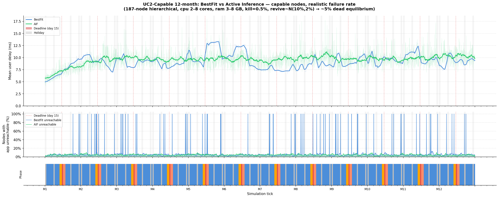

# Active Inference as a Placement Strategy in ECLYPSE

MSc project studying **Active Inference (AIF)** as a service-placement strategy
in the [ECLYPSE](https://github.com/eclypse-org/eclypse) edge-cloud continuum
simulator. The use case is a government water-usage declaration service deployed
across a hierarchical edge-fog-cloud infrastructure.

The core question: can an agent that minimises *Expected Free Energy* (Friston
et al.) outperform the standard BestFit heuristic when infrastructure nodes fail
and user load varies with a monthly calendar cycle?

**Key result (12-month simulation, ~5% dead-node equilibrium):**

| Metric | BestFit | AIF |
|---|---|---|
| Mean user delay | 9.1 ms | 9.6 ms |
| Mean unreachable fraction | 6.75% | 4.63% |
| Ticks at 100% unreachable | 77 (2.1%) | **0** |
| Effective delay (10 s timeout) | ~683 ms | ~472 ms |

AIF never causes a complete outage; BestFit does so on 77 ticks.



---

## Repository structure

```
eclypse-aif-placement/
├── eclypse/                   # ECLYPSE fork (git submodule, branch aif-placement)
│
├── uc1_experiment.py          # UC1: reproduce ECLYPSE paper latency/placement plots
├── uc1_*.py                   # UC1 extended runs and plot scripts
│
├── uc2_experiment.py          # UC2 baseline (original infrastructure)
├── uc2_calendar_*.py          # UC2 with calendar-driven load
├── uc2_recovery_*.py          # UC2 with node revival dynamics
├── uc2_constrained_*.py       # UC2 with resource-constrained nodes (negative result)
├── uc2_capable_*.py           # UC2 with capable nodes, 3-month run
├── uc2_capable_12m_*.py       # UC2 capable nodes, 12-month run (main result)
│
├── uc3_experiment.py          # UC3: CV/ML pipeline (Ray, image prediction)
├── uc3_plot.py
│
├── debug_min_energy*.py       # Debugging scripts (energy minimisation strategy)
├── results/                   # Figures and simulation config files
│   ├── uc1/figures/
│   ├── uc2*/figures/
│   └── uc3/figures/
│
├── pyproject.toml             # Project dependencies (uv)
└── uv.lock                    # Pinned dependency versions
```

The ECLYPSE submodule (`eclypse/`) is pinned to commit `d6797a1` on the
`aif-placement` branch. The tag `paper-baseline` in that fork marks the exact
upstream v0.9.0 state the project started from; `git diff paper-baseline
aif-placement` shows every modification made to the simulator.

---

## Prerequisites

- **Python 3.12**
- **[uv](https://docs.astral.sh/uv/)** — Python package manager

Install `uv` if you do not have it:

```bash
curl -LsSf https://astral.sh/uv/install.sh | sh
```

---

## Setup

Clone the repository together with the ECLYPSE submodule:

```bash
git clone --recurse-submodules \
    git@github.com:franzm64/eclypse-aif-placement.git
cd eclypse-aif-placement
```

If you have already cloned without `--recurse-submodules`:

```bash
git submodule update --init
```

Install all dependencies (ECLYPSE is installed in editable mode from the
submodule, so its patched source is used automatically):

```bash
uv sync
```

Verify the installation:

```bash
uv run python -c "import eclypse; import numpy; print('OK')"
```

---

## Running the main experiment

The primary result is the 12-month BestFit vs AIF comparison on a 187-node
hierarchical infrastructure with capable nodes (cpu 2–8 cores, ram 3–8 GB) and
a realistic failure rate (kill=0.5%, revive~N(10%, 2%) → ~5% dead equilibrium).

Run BestFit and AIF simulations (each takes roughly 30–60 minutes):

```bash
uv run python uc2_capable_12m_bestfit_experiment.py
uv run python uc2_capable_12m_aif_experiment.py
```

Results are written to timestamped subdirectories under `results/`. Update the
`BESTFIT_CSV` and `AIF_CSV` paths in `uc2_capable_12m_compare_plot.py` to point
at the new run directories, then generate the comparison figure:

```bash
uv run python uc2_capable_12m_compare_plot.py
```

---

## Running all experiments

| Script | Description |
|---|---|
| `uc1_experiment.py` | UC1: placement strategy comparison, 20 configurations |
| `uc2_experiment.py` | UC2 baseline with original uniform load |
| `uc2_calendar_experiment.py` | UC2 with monthly calendar-driven load (BestFit) |
| `uc2_aif_experiment.py` | UC2 with AIF placement, calendar load |
| `uc2_capable_bestfit_experiment.py` | UC2 capable nodes, 3-month, BestFit |
| `uc2_capable_aif_experiment.py` | UC2 capable nodes, 3-month, AIF |
| `uc2_capable_12m_bestfit_experiment.py` | UC2 capable nodes, **12-month**, BestFit |
| `uc2_capable_12m_aif_experiment.py` | UC2 capable nodes, **12-month**, AIF |
| `uc3_experiment.py` | UC3: image-prediction ML pipeline (requires Ray) |

All scripts are run with `uv run python <script>.py`.

---

## ECLYPSE modifications

Three commits on top of ECLYPSE v0.9.0 (`paper-baseline`):

1. **Bug fixes** — latency-cache invalidation in `infrastructure.path_resources()`,
   energy-attribute lookup in `grid_analysis`, API renames in `image_prediction`.
2. **Adaptive placement** — `PlacementManager.mapping_phase()` now re-places
   every tick when the strategy sets `adaptive = True`.
3. **AIF user-distribution example** — new `aif_strategy.py`,
   `application.py` (replicated SockShop with availability requirements),
   `calendar_policy.py`; extended `infrastructure.py`, `metric.py`, and
   `update_policy.py`.

---

## References

- Massa, J. & De Caro, V. — *ECLYPSE: an Edge-CLoud pYthon Platform for
  Simulated runtime Environments* (see `eclypse/CITATION.cff`)
- Friston, K. et al. — *Active inference and epistemic value*, Cognitive
  Neuroscience, 2017
- Heins, C. et al. — *pymdp: A Python library for active inference in discrete
  state spaces*, JMLR, 2022
